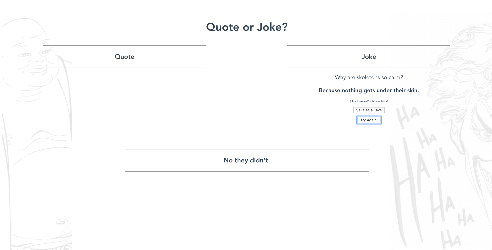

# Quote or Joke

Quote or Joke is a small program I wrote to fulfill the week 7 CodeClan weekend homework brief.



It pulls from two seperate APIs to produce either a joke or a quote.

The 'No They Didn't' section combines a joke's punchline with a quote's author randomly.

The 'Roll Up, Roll Up' section is a small guessing game that provides a quote and three possible quote authors to guess from.

## Project setup
```
npm install
```

### Compiles and hot-reloads for development
```
npm run serve
```
